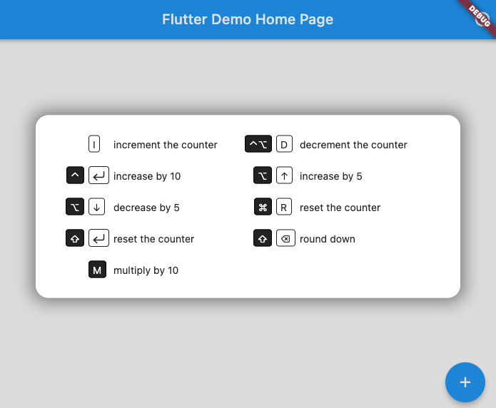
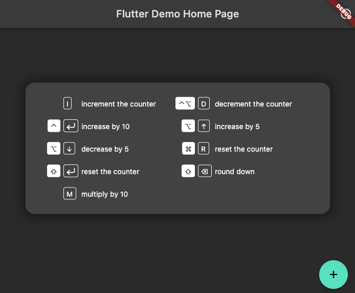

# Keymap

A keymap widget letting a developer easily allow end users to use keyboard shortcuts
and an associated help screen overlay to any app.

## Getting started
[](https://pub.dev/packages/keymap)

```
dependencies:
  keymap: <latest-version>
```

## Features

- Easily add keyboard shortcuts to any widget tree
- Clear, readable help screen 
- Insert at any point in the widget tree
- Respects application theme colors and fonts

## Usage

Create a list of shortcuts and methods to be called:
```dart
  List<KeyAction> _getShortcuts() {
    return [
      KeyAction(LogicalKeyboardKey.keyI,'increment the counter', _incrementCounter,),
      KeyAction(LogicalKeyboardKey.keyD, 'decrement the counter', _decrementCounter,
        isAltPressed: true, isControlPressed: true),
      KeyAction(LogicalKeyboardKey.enter,'increase by 10',
        (){ increaseBy(10); }, isControlPressed: true
      ),
```

Add those shortcuts into your widget tree
```dart
  @override
  Widget build(BuildContext context) {
    //the KeyBoardWidget is at the root of the app so that
    //all key-presses are registered
    return KeyboardWidget(
      key: _key,
      keyMap: shortcuts, columnCount: 2,
      child: Scaffold(
        appBar: AppBar(
          title: Text(widget.title),
          actions: [
            Tooltip(message: 'Show keyboard shortcuts',
             child: IconButton(icon: const Icon(Icons.help_outline), onPressed: () {
              _key.currentState?.toggleOverlay();
            },)),
          ],
        ),

```
This creates keyboard shortcuts that call the referenced methods and a help screen
that can be called up by pressing F1:



It will shift colors to match your app's theme (here in dark mode)

## Additional information

TODO: Tell users more about the package: where to find more information, how to 
contribute to the package, how to file issues, what response they can expect 
from the package authors, and more.
