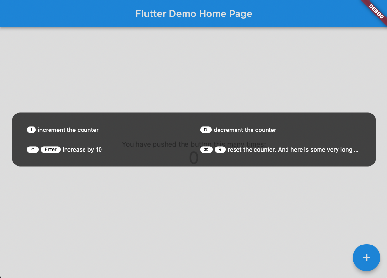

<!-- 
This README describes the package. If you publish this package to pub.dev,
this README's contents appear on the landing page for your package.

For information about how to write a good package README, see the guide for
[writing package pages](https://dart.dev/guides/libraries/writing-package-pages). 

For general information about developing packages, see the Dart guide for
[creating packages](https://dart.dev/guides/libraries/create-library-packages)
and the Flutter guide for
[developing packages and plugins](https://flutter.dev/developing-packages). 
-->
# Keymap

A keymap widget letting a developer easily allow end users to use keyboard
shortcuts in any app.

## Getting started
[](https://pub.dev/packages/cupertino_icons)

```
dependencies:
  keymap: ^<latest-version>
```

## Features

- Clear, readable display of keymaps over any application
- Insert at any point in the widget tree

## Usage

```dart
  @override
Widget build(BuildContext context) {
  List<KeyStrokeRep> shortcuts = [
    KeyStrokeRep(LogicalKeyboardKey.keyI,'increment the counter', () => _incrementCounter(),),
    KeyStrokeRep(LogicalKeyboardKey.keyD, 'decrement the counter', () => _decrementCounter()),
    KeyStrokeRep(LogicalKeyboardKey.enter,'increase by 10', (){
      increaseBy(10);
    },isControlPressed: true),
    KeyStrokeRep(LogicalKeyboardKey.keyR,'reset the counter. And here is some very long text to test overflow', (){
      _resetCounter();
    },isMetaPressed: true),
  ];

  return KeyboardWidget(
      keyMap: shortcuts,
```

## Additional information

TODO: Tell users more about the package: where to find more information, how to 
contribute to the package, how to file issues, what response they can expect 
from the package authors, and more.
